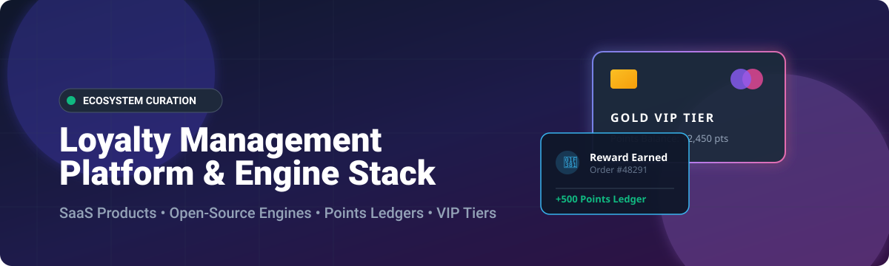
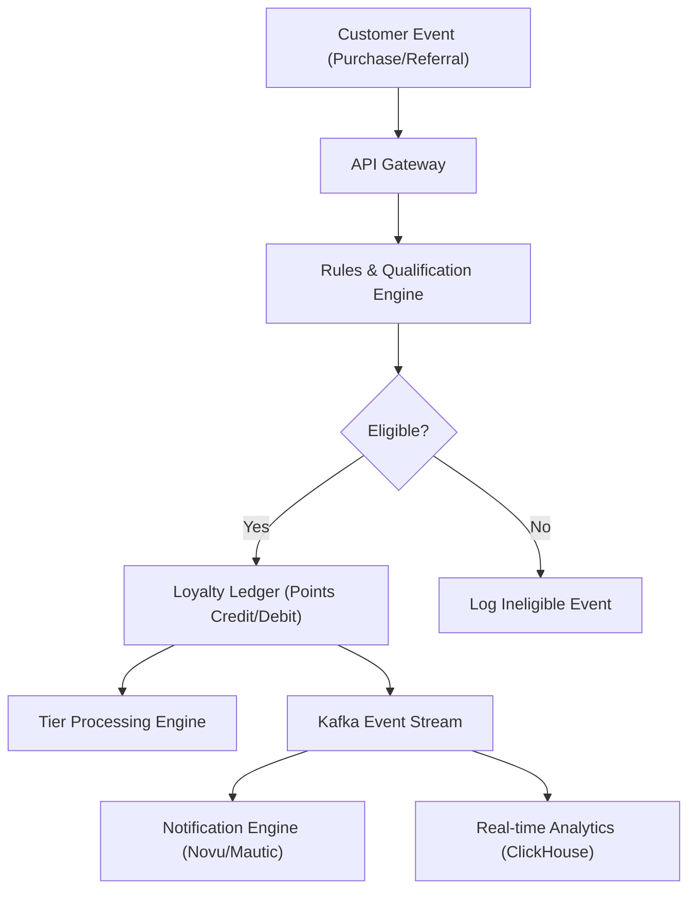

<p align="center">
  
</p>

# 🏆 Awesome Loyalty Management Platform

<p align="center">
  <a href="https://github.com/ishandutta2007/Awesome-Awesome-Awesome"></a><a href="https://discord.gg/jc4xtF58Ve"></a>
  <a href="https://awesome.re"></a>
  <a href="https://github.com/ishandutta2007/Awesome-Loyalty-Management-Platform"></a>
  <a href="https://github.com/ishandutta2007"></a>
</p>

## 🚀 Top Loyalty Management Platforms & Open-Source Ecosystem

**Curated List of SaaS Products & Open-Source GitHub Projects for Customer Loyalty 🎁, Rewards 💎, Points 🪙, VIP Tiers 👑, Referrals 👥 & Customer Engagement Infrastructure ⚡.**

> 📊 **Market Overview**: The global loyalty management market is estimated at **$12.6B – $16.9B (2025)** and projected to reach **$14.8B – $19.8B (2026)**. The sector is **moderately fragmented**, featuring a mix of enterprise platforms, specialized vertical tools, and self-hosted open-source loyalty engines competing on AI personalization and API-first architecture.

---

## 📑 Table of Contents

- [💼 SaaS / Hosted Loyalty Platforms](#-saas--hosted-loyalty-platforms)
- [🔓 Open-Source GitHub Projects](#-open-source-github-projects)
  - [⚙️ Open-Source Loyalty Engines & Tools](#️-open-source-loyalty-engines--tools)
  - [🛒 Open-Source Commerce & ERP Foundations](#-open-source-commerce--erp-foundations)
  - [📢 Customer Engagement & Infrastructure](#-customer-engagement--infrastructure)
- [🏗️ Building a Self-Hosted Loyalty Platform](#️-building-a-self-hosted-loyalty-platform)
- [🔄 Commercial → Open-Source Equivalents](#-commercial--open-source-equivalents)
- [📦 Recommended Open-Source Stacks](#-recommended-open-source-stacks)
- [📐 Loyalty Management Architecture](#-loyalty-management-architecture)
- [🤝 How to Contribute](#-how-to-contribute)
- [💖 Support & Sponsorship](#-support--sponsorship)
- [⚠️ Disclaimer](#️-disclaimer)
- [📈 Star History](#-star-history)

---

## 💼 SaaS / Hosted Loyalty Platforms

| Platform | Starting Price | Free Tier / Trial Limit | Company Size (Valuation / Revenue) | Key Features & Focus |
| :--- | :--- | :--- | :--- | :--- |
| **[Salesforce Loyalty Management](https://www.salesforce.com/)** | $20,000 / year ($1,666/mo) | No free tier; 30-day free trial | $200B+ Market Cap / $41.5B Revenue | Native enterprise CRM loyalty engine with multi-program management and B2B/B2C capabilities. |
| **[FiveStars (SumUp Connect)](https://www.fivestars.com/)** | $269 / month | No free trial (subscription based) | $8.5B Valuation / Acquired for $317M | Local business loyalty, payment integration, text-to-join, and automated customer marketing. |
| **[Braze](https://www.braze.com/)** | ~$5,000 / month ($60k/yr starting) | 14-day free trial | $2.8B Market Cap / $738M Revenue | Customer engagement & retention infrastructure with credit-based cross-channel messaging. |
| **[Yotpo Loyalty](https://www.yotpo.com/platform/loyalty/)** | $199 / month | Free plan available (up to 100 orders/mo) | $1.4B Valuation / $213M ARR | Ecommerce loyalty, customizable points, VIP tiers, referral modules, and SMS integrations. |
| **[Talon.One](https://www.talon.one/)** | ~$2,500 / month (Custom Enterprise) | 14-day developer trial | $876M Valuation (€750M Adyen deal) / €60M ARR | Headless, API-first promotion engine, referral logic, rules engine, and complex customer incentives. |
| **[Klaviyo](https://www.klaviyo.com/)** | $20 / month | Free plan (up to 250 contacts, 500 emails/mo) | $4.7B Market Cap / $1.23B Revenue | Data-driven marketing automation & customer lifecycle management platform with native loyalty integrations. |
| **[Comarch Loyalty](https://www.comarch.com/)** | ~$2,500 / month (Custom Enterprise) | No free trial or free tier | ~$475M Market Cap (PLN 1.9B Rev) | Enterprise loyalty management, gamification, coalition programs, and omnichannel personalization. |
| **[Zinrelo](https://www.zinrelo.com/)** | ~$1,000 / month (Custom Enterprise) | Demo available upon request | $597M Est. Valuation / $56M ARR | Enterprise AI-powered loyalty software, referral marketing, and multi-tier loyalty programs. |
| **[Annex Cloud](https://www.annexcloud.com/)** | ~$2,000 / month (Custom Enterprise) | No free trial (Acquired by Edited Capital) | ~$50M Revenue (Acquired 2025) | Enterprise customer loyalty platform focusing on mid-market/enterprise (> $250M rev) organizations. |
| **[Capillary Technologies](https://www.capillarytech.com/)** | ~$2,500 / month (Revenue Share / Enterprise) | Demo available (No self-serve trial) | ~$435M Market Cap (₹3,637 Cr) / ₹7.3B Revenue | Enterprise omnichannel loyalty suite (Loyalty+, Engage+), AI personalization, and customer data platform. |
| **[PAR Punchh](https://punchh.com/)** | ~$1,500 / month (Custom Enterprise) | No free trial | $31.5M ARR / Parent PAR $500M Acquisition | Restaurant & retail loyalty platform, mobile ordering, CRM, and customer engagement infrastructure. |
| **[LoyaltyLion](https://loyaltylion.com/)** | $199 / month | Free plan available (up to 400 orders/mo) | $12M ARR ($12.9M Funding) | Shopify loyalty & engagement platform focused on points, rewards, VIP tiers, and referrals. |
| **[Thanx](https://www.thanx.com/)** | $99 / month | No free plan or free trial | $9M ARR ($21M+ Funding) | Restaurant customer retention platform with credit card-linked loyalty, CRM, and digital ordering. |
| **[Open Loyalty (SaaS)](https://www.openloyalty.io/)** | ~$500 / month (Custom API plan) | Demo available upon request | $5.5M ARR | API-first headless loyalty software for custom digital apps, fintechs, and omnichannel retail. |
| **[Kangaroo Rewards](https://loyalty.kangaroorewards.com/)** | $79 / month | 14-day free trial | $3.3M ARR | SMB loyalty and rewards software covering retail, restaurants, custom marketing, and gift cards. |
| **[Smile.io](https://smile.io/)** | $15 / month | Free plan available (up to 200 orders/mo) | $1.8M ARR ($1M Funding) | Turnkey ecommerce points, referral, and VIP program widget for Shopify and BigCommerce. |
| **[Loyalty Gator](https://loyaltygator.com/)** | $88 / month | 30-day free trial | Private SMB Vendor | Web-based customer loyalty software, gift cards, and employee reward systems. |
| **[TapMango](https://www.tapmango.com/)** | ~$150 / month (Custom Flat-rate) | Promotional 2 months free with demo | Private SMB Vendor | Customer loyalty and marketing platform for local retail & dining with custom branded touchscreen tablets. |
| **[Kobie](https://kobie.com/)** | Custom Enterprise Consulting | No free trial | Private Enterprise Vendor ($41M–$100M Rev) | Enterprise loyalty strategy, Kobie Alchemy Loyalty Cloud, and end-to-end program management. |
| **[LoyaltyGenius](https://loyaltygenius.com/)** | Custom Enterprise / SMB Quote | Demo available upon request | Private Vendor | Loyalty program technology and custom text message marketing tools. |

---

## 🔓 Open-Source GitHub Projects

The open-source loyalty ecosystem offers powerful, self-hosted building blocks for developers building custom rewards infrastructure, transactional points ledgers, or self-managed commerce integrations.

### ⚙️ Open-Source Loyalty Engines & Tools

* **[Open Loyalty](https://github.com/dpaczewski/open-loyalty)** [](https://github.com/dpaczewski/open-loyalty/stargazers)  
  Headless open-source loyalty engine with API-first support for points, rewards, tiers, transactions, and gamification workflows.

* **[Refref](https://github.com/amicalhq/refref)** [](https://github.com/amicalhq/refref/stargazers)  
  Open-source referral and affiliate marketing platform designed to build virality and reward mechanics into web applications.

* **[Tezos Reward Distributor](https://github.com/tezos-reward-distributor-organization/tezos-reward-distributor)** [](https://github.com/tezos-reward-distributor-organization/tezos-reward-distributor/stargazers)  
  Automated reward distribution system for Tezos delegators and staking loyalty nodes.

* **[Loyalty Bridge](https://github.com/KodeBarista/loyalty-bridge)** [](https://github.com/KodeBarista/loyalty-bridge/stargazers)  
  Open-source web-based loyalty management application for tracking customer loyalty coins, rewards, and discounts.

* **[Loyalty Engine](https://github.com/PYAG1/loyalty-engine)** [](https://github.com/PYAG1/loyalty-engine/stargazers)  
  Event-driven loyalty microservice demonstrating points earning, tier progression, referral bonuses, and customer segmentation.

* **[Savvy](https://github.com/sbaerlocher/savvy)** [](https://github.com/sbaerlocher/savvy/stargazers)  
  Self-hosted digital card management system for loyalty cards, vouchers, gift cards, and barcode scanning.

* **[Shopify Loyalty System](https://github.com/daheige/loyalty-system)** [](https://github.com/daheige/loyalty-system/stargazers)  
  Open-source backend engine for Shopify stores supporting points, tier benefits, expiration, referrals, and webhooks.

* **[Spree Loyalty](https://github.com/amitkssolanki/spree_loyalty)** [](https://github.com/amitkssolanki/spree_loyalty/stargazers)  
  Points loyalty extension for Spree Commerce featuring store credit redemptions and an auditable points ledger.

* **[VirtoCommerce Loyalty](https://github.com/VirtoCommerce/vc-module-loyalty)** [](https://github.com/VirtoCommerce/vc-module-loyalty/stargazers)  
  Modular loyalty extension for Virto Commerce supporting custom reward rules, points, and point-based payments.

* **[Ballkit Platform](https://github.com/ballkit/ballkit-platform)** [](https://github.com/ballkit/ballkit-platform/stargazers)  
  Self-hosted SMB loyalty platform with points rewards, store administration, and Telegram bot interaction.

* **[LoyaltySystem](https://github.com/ryangillooly/LoyaltySystem)** [](https://github.com/ryangillooly/LoyaltySystem/stargazers)  
  Multi-brand loyalty management system supporting stamp-based and points-based programs.

---

### 🛒 Open-Source Commerce & ERP Foundations

These popular open-source platforms provide native extensions, APIs, or data modules ideal for custom loyalty integration:

* **[Odoo](https://github.com/odoo/odoo)** [](https://github.com/odoo/odoo/stargazers)  
  Open-source ERP suite featuring integrated POS, CRM, ecommerce, and customer loyalty program modules.

* **[ERPNext](https://github.com/frappe/erpnext)** [](https://github.com/frappe/erpnext/stargazers)  
  Open-source enterprise resource planning platform with native customer loyalty point management.

* **[Medusa](https://github.com/medusajs/medusa)** [](https://github.com/medusajs/medusa/stargazers)  
  API-first headless commerce framework built for creating bespoke rewards, custom logic, and referral extensions.

* **[Saleor](https://github.com/saleor/saleor)** [](https://github.com/saleor/saleor/stargazers)  
  GraphQL-driven headless commerce engine for integrating custom loyalty APIs and customer incentives.

* **[Spree Commerce](https://github.com/spree/spree)** [](https://github.com/spree/spree/stargazers)  
  Ruby on Rails open-source ecommerce platform with built-in promotions and points ecosystem compatibility.

* **[WooCommerce](https://github.com/woocommerce/woocommerce)** [](https://github.com/woocommerce/woocommerce/stargazers)  
  Flexible open-source ecommerce plugin for WordPress with extensive community loyalty extensions.

* **[Squidex](https://github.com/Squidex/squidex)** [](https://github.com/Squidex/squidex/stargazers)  
  Headless CMS and content management system frequently used to manage multi-channel loyalty campaign content.

* **[Virto Commerce](https://github.com/VirtoCommerce/vc-platform)** [](https://github.com/VirtoCommerce/vc-platform/stargazers)  
  Enterprise ASP.NET Core open-source commerce platform equipped with custom loyalty modules.

* **[Apache OFBiz](https://github.com/apache/ofbiz-framework)** [](https://github.com/apache/ofbiz-framework/stargazers)  
  Enterprise automation framework providing foundational models for complex customer loyalty and promotion rules.

---

### 📢 Customer Engagement & Infrastructure

To operate a production loyalty infrastructure, companies rely on open-source data ledgers, notification pipes, and rule engines:

* **[Grafana](https://github.com/grafana/grafana)** [](https://github.com/grafana/grafana/stargazers) — Observability dashboarding for real-time tracking of loyalty transaction rates.
* **[Redis](https://github.com/redis/redis)** [](https://github.com/redis/redis/stargazers) — In-memory data store for caching points balances and rate-limiting earning actions.
* **[Apache Superset](https://github.com/apache/superset)** [](https://github.com/apache/superset/stargazers) — Enterprise data exploration & visualization platform for loyalty member analytics.
* **[ClickHouse](https://github.com/ClickHouse/ClickHouse)** [](https://github.com/ClickHouse/ClickHouse/stargazers) — High-performance columnar database for real-time customer event analytics.
* **[Metabase](https://github.com/metabase/metabase)** [](https://github.com/metabase/metabase/stargazers) — Open-source business intelligence tool for visualizing customer retention rates.
* **[Novu](https://github.com/novuhq/novu)** [](https://github.com/novuhq/novu/stargazers) — Open-source notification infrastructure for triggering loyalty reward alerts via Email, SMS, and Push.
* **[PostHog](https://github.com/PostHog/posthog)** [](https://github.com/PostHog/posthog/stargazers) — Product analytics platform to track user engagement and loyalty conversion funnels.
* **[ntfy](https://github.com/binwiederhier/ntfy)** [](https://github.com/binwiederhier/ntfy/stargazers) — Simple HTTP-based pub-sub notification service for immediate loyalty alerts.
* **[Apache Kafka](https://github.com/apache/kafka)** [](https://github.com/apache/kafka/stargazers) — Distributed event-streaming platform for event-driven earning and redemption processing.
* **[Listmonk](https://github.com/knadh/listmonk)** [](https://github.com/knadh/listmonk/stargazers) — High-performance self-hosted newsletter and customer campaign manager.
* **[Temporal](https://github.com/temporalio/temporal)** [](https://github.com/temporalio/temporal/stargazers) — Durable execution framework for orchestrating long-running tier qualification workflows.
* **[PostgreSQL](https://github.com/postgres/postgres)** [](https://github.com/postgres/postgres/stargazers) — Relational SQL database for auditable double-entry loyalty ledgers.
* **[NATS](https://github.com/nats-io/nats-server)** [](https://github.com/nats-io/nats-server/stargazers) — Lightweight event messaging system for microservice loyalty architectures.
* **[Open Policy Agent (OPA)](https://github.com/open-policy-agent/opa)** [](https://github.com/open-policy-agent/opa/stargazers) — Policy engine for evaluating complex member eligibility rules.
* **[Mautic](https://github.com/mautic/mautic)** [](https://github.com/mautic/mautic/stargazers) — Open-source marketing automation engine for multi-stage loyalty drip campaigns.
* **[Camunda](https://github.com/camunda/camunda)** [](https://github.com/camunda/camunda/stargazers) — Process orchestration engine for enterprise loyalty workflows.

---

## 🏗️ Building a Self-Hosted Loyalty Platform

A scalable self-hosted loyalty architecture separates core event intake, rules processing, and transactional points accounting:

```text
                    Ecommerce / POS / Mobile App
                                │
                                ▼
                       Loyalty Gateway / API
                                │
            ┌───────────────────┼───────────────────┐
            ▼                   ▼                   ▼
     Customer Identity     Rules Engine      Reward Catalog
            │                   │                   │
            └───────────────────┼───────────────────┘
                                ▼
                      Transactional Ledger
                                │
                      ┌─────────┴─────────┐
                      ▼                   ▼
               Tier Engine         Referral Engine
                      │                   │
                      └─────────┬─────────┘
                                ▼
                       Event Stream (Kafka)
                                │
            ┌───────────────────┼───────────────────┐
            ▼                   ▼                   ▼
       Email (Mautic)       SMS / Push          Analytics
```

---

## 🔄 Commercial → Open-Source Equivalents

| Commercial Platform | Open-Source Equivalent Stack |
| :--- | :--- |
| **LoyaltyLion / Smile.io** | Open Loyalty + Medusa / Spree Commerce + Novu |
| **Yotpo Loyalty** | Open Loyalty + PostHog + Listmonk |
| **Talon.One** | Open Loyalty + Open Policy Agent (OPA) + Temporal |
| **Zinrelo / Antavo** | Open Loyalty + Temporal + PostgreSQL Ledger + Metabase |
| **PAR Punchh** | Ballkit + Kafka + PostgreSQL + Novu |
| **SessionM / Capillary** | Open Loyalty + Apache Kafka + ClickHouse + Mautic |

---

## 📦 Recommended Open-Source Stacks

### 1. Ecommerce Loyalty Stack
- **Ecommerce**: Medusa or Spree Commerce
- **Loyalty Backend**: Spree Loyalty / Open Loyalty
- **Ledger**: PostgreSQL
- **Notifications**: Novu / Listmonk

### 2. API-First Enterprise Stack
- **Engine**: Open Loyalty
- **Rules & Orchestration**: Open Policy Agent (OPA) + Temporal
- **Data & Streaming**: PostgreSQL + Apache Kafka + ClickHouse
- **Analytics**: Metabase / Grafana

---

## 📐 Loyalty Management Architecture



---

## 🤝 How to Contribute

1. **Fork** the repository.
2. Add your project under the appropriate section following alphabetical/star ordering.
3. Ensure factual descriptions and verify project licensing.
4. Submit a **Pull Request**.

---

## 💖 Support & Sponsorship

Thank you for exploring and using this curated ecosystem resource! If you find this repository helpful in building or evaluating loyalty platforms, please consider supporting the project:

- ⭐️ **Star** this repository to increase its visibility for developers and businesses.
- 🔀 **Fork** it to customize your own internal loyalty tech stack evaluation.
- 📢 **Share** it with your engineering, product, and growth teams.
- ☕ **Buy Me a Coffee / Sponsor**: Support further open-source research and maintenance on the [GitHub Sponsor Dashboard](https://github.com/sponsors/ishandutta2007).

---

## ⚠️ Disclaimer

- This list is **community-curated** for educational and research purposes.
- SaaS pricing, features, and financial metrics reflect market estimates as of late 2026.
- Always perform technical and security evaluations prior to self-hosting loyalty engines.

---

## 📈 Star History

[](https://star-history.dera.page/#ishandutta2007/Awesome-Loyalty-Management-Platform&type=date&legend=top-left)

---

**Made for ecommerce brands 🛍️, software engineers 💻, product managers 📊, and loyalty architects 🏛️.**
