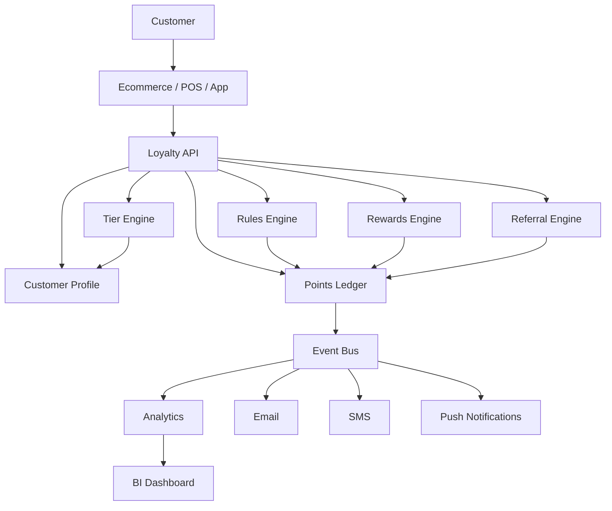
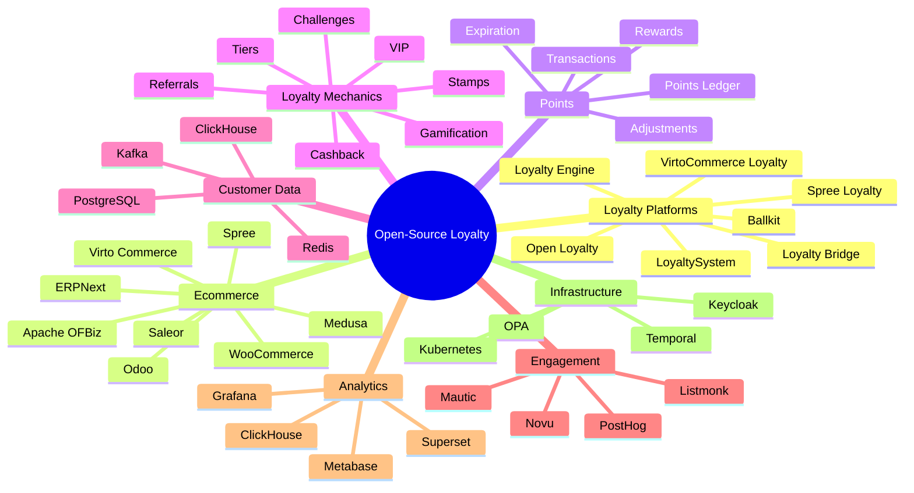

# Awesome-Loyalty-Management-Platform

## Top Loyalty Management Platforms Ecosystem

**Curated List of SaaS Products & Open-Source GitHub Projects**
*Focused on Customer Loyalty, Rewards, Points, VIP Tiers, Referrals & Engagement*
**Last updated: September 2026**

This repository tracks notable **SaaS platforms** and **open-source projects** for **Loyalty Management**. These platforms help businesses create and operate customer loyalty programs covering points, rewards, VIP tiers, referrals, gamification, customer engagement, omnichannel loyalty, personalization, and loyalty analytics.

**Examples** include LoyaltyLion, Yotpo Loyalty, Smile.io, Zinrelo, Annex Cloud, Antavo, Open Loyalty, Kangaroo Rewards, Capillary Technologies, TapMango, Talon.One, Comarch Loyalty, and SessionM.

**Open-source emphasis**: This section is heavily expanded with open-source loyalty engines, rewards systems, ecommerce loyalty modules, referral systems, gamification platforms, customer-points ledgers, and self-hosted building blocks — useful for developers and businesses building customizable loyalty infrastructure rather than depending entirely on proprietary SaaS.

> **Important distinction:** Open-source loyalty software is generally available as a component or self-hosted loyalty engine. It does not necessarily provide the enterprise integrations, managed infrastructure, POS ecosystem, customer data platform, campaign operations, or omnichannel services available from commercial loyalty platforms.

Contributions welcome! Open a PR to add/update entries. Keep descriptions factual and link to official sites or GitHub repositories.

## Table of Contents

* [SaaS/Hosted Platforms](#saashosted-platforms)
* [Open-Source GitHub Projects](#open-source-github-projects)
* [Open-Source Loyalty Engines](#open-source-loyalty-engines)
* [Open-Source Ecommerce Loyalty](#open-source-ecommerce-loyalty)
* [Open-Source Rewards & Points Systems](#open-source-rewards--points-systems)
* [Open-Source Referral & Gamification](#open-source-referral--gamification)
* [Open-Source Customer Engagement Infrastructure](#open-source-customer-engagement-infrastructure)
* [Building a Self-Hosted Loyalty Platform](#building-a-self-hosted-loyalty-platform)
* [Commercial → Open-Source Equivalents](#commercial--open-source-equivalents)
* [Recommended Open-Source Stacks](#recommended-open-source-stacks)
* [Loyalty Management Architecture](#loyalty-management-architecture)
* [How to Contribute](#how-to-contribute)
* [Disclaimer](#disclaimer)

## SaaS/Hosted Platforms

* **[LoyaltyLion](https://loyaltylion.com/)**
  Customer loyalty platform focused on points, rewards, referrals, VIP tiers, analytics, headless APIs, and omnichannel loyalty. LoyaltyLion supports reward earning through purchases, referrals, reviews and other customer activities.

* **[Yotpo Loyalty](https://www.yotpo.com/platform/loyalty/)**
  Ecommerce loyalty platform providing customizable earning rules, rewards, VIP tiers, referrals, loyalty analytics, and integrations with commerce and marketing platforms.

* **[Smile.io](https://smile.io/)**
  Loyalty and rewards platform focused on points, referrals, VIP programs, loyalty hubs, ecommerce integrations, and customer retention.

* **[Zinrelo](https://www.zinrelo.com/)**
  Enterprise loyalty platform supporting points, tiers, referrals, rewards, engagement, personalization, and loyalty analytics.

* **[Annex Cloud](https://www.annexcloud.com/)**
  Enterprise customer loyalty and engagement platform supporting loyalty programs, rewards, referrals, customer engagement, and omnichannel experiences.

* **[Antavo](https://antavo.com/)**
  Enterprise loyalty technology platform for loyalty programs, gamification, rewards, customer engagement, and personalized experiences.

* **[Open Loyalty](https://www.openloyalty.io/)**
  API-first loyalty and gamification platform supporting loyalty members, transactions, points, tiers, earning rules, rewards, campaigns, and integrations.

* **[Kangaroo Rewards](https://loyalty.kangaroorewards.com/)**
  Loyalty and rewards platform focused on SMBs, restaurants, retail, customer engagement, rewards, and marketing.

* **[Capillary Technologies](https://www.capillarytech.com/)**
  Enterprise customer loyalty and engagement platform covering loyalty management, personalization, customer data, promotions, and omnichannel engagement.

* **[TapMango](https://www.tapmango.com/)**
  Customer loyalty and marketing platform for restaurants and local businesses with rewards, customer engagement, promotions, and marketing automation.

* **[Talon.One](https://www.talon.one/)**
  API-first promotion, loyalty, campaign, discount, referral, and incentive management platform with a rules engine for complex customer programs.

* **[Comarch Loyalty Marketing](https://www.comarch.com/)**
  Enterprise loyalty and customer engagement platform covering loyalty programs, personalization, rewards, analytics, and omnichannel engagement.

* **[SessionM](https://www.mastercardservices.com/)**
  Customer loyalty and engagement technology focused on rewards, personalization, customer data, promotions, and loyalty experiences.

### Additional Commercial Loyalty Platforms

* **[Loyalty Gator](https://loyaltygator.com/)** — Loyalty and rewards management for businesses and customer engagement programs.
* **[Kobie](https://kobie.com/)** — Enterprise loyalty strategy, technology, and program management.
* **[Punchh](https://punchh.com/)** — Restaurant loyalty, CRM, ordering, personalization, and customer engagement.
* **[PAR Punchh](https://partech.com/)** — Restaurant loyalty and engagement infrastructure.
* **[Thanx](https://www.thanx.com/)** — Customer retention, loyalty, CRM, and marketing for restaurants.
* **[FiveStars](https://www.fivestars.com/)** — Customer loyalty and marketing for local businesses.
* **[LoyaltyGenius](https://loyaltygenius.com/)** — Loyalty program technology and rewards management.
* **[Yotpo](https://www.yotpo.com/)** — Broader ecommerce customer experience platform including loyalty, reviews, SMS, and retention.
* **[Klaviyo](https://www.klaviyo.com/)** — Customer data and marketing automation frequently integrated with loyalty programs.
* **[Braze](https://www.braze.com/)** — Customer engagement infrastructure commonly used to activate loyalty data.
* **[Salesforce Loyalty Management](https://www.salesforce.com/)** — Enterprise loyalty management integrated with CRM and customer data.

## Open-Source GitHub Projects

The open-source loyalty ecosystem is considerably smaller than the commercial SaaS market. However, several projects provide useful building blocks for creating self-hosted loyalty systems.

### Major Open-Source Loyalty Platforms

* **[Open Loyalty](https://github.com/dpaczewski/open-loyalty)**
  Open-source loyalty technology with ready-to-use loyalty and gamification features. It supports customer programs, points, rewards, transactions, and customizable loyalty workflows.

* **[Spree Loyalty](https://github.com/amitkssolanki/spree_loyalty)**
  POS-agnostic points loyalty extension for Spree Commerce. Customers earn points on completed orders and can redeem them through Spree Store Credit. It maintains an auditable transaction ledger for loyalty activity.

* **[VirtoCommerce Loyalty](https://github.com/VirtoCommerce/vc-module-loyalty)**
  Loyalty module for VirtoCommerce supporting loyalty programs, reward rules, points, transaction logging, and loyalty-point payments.

* **[Ballkit](https://github.com/ballkit/ballkit-platform)**
  Self-hosted loyalty platform aimed at SMBs with points-based rewards, business/store administration, transaction processing, and Telegram-based customer interaction.

* **[Loyalty Bridge](https://github.com/KodeBarista/loyalty-bridge)**
  Open-source web loyalty management application for tracking customer loyalty, loyalty coins, rewards, and discounts.

* **[LoyaltySystem](https://github.com/ryangillooly/LoyaltySystem)**
  Loyalty management system supporting both stamp-based and points-based programs, rewards, multi-brand programs, and POS integration.

* **[Loyalty Engine](https://github.com/PYAG1/loyalty-engine)**
  Event-driven loyalty engine demonstrating points earning, tier progression, referral bonuses, customer segmentation, and transactional loyalty logic.

* **[Shopify Loyalty System](https://github.com/daheige/loyalty-system)**
  Open-source loyalty backend supporting points earning, redemption, tier progression, benefits, referrals, expiration, event-driven processing, and Shopify webhook integration.

* **[Savvy](https://github.com/sbaerlocher/savvy)**
  Self-hosted open-source digital management system for loyalty cards, vouchers, gift cards, barcode scanning, and transaction history.

### Additional Strong Open-Source Options

* **[Open Loyalty](https://github.com/dpaczewski/open-loyalty)** — Headless/API-oriented loyalty and gamification foundation.
* **[Spree Commerce](https://github.com/spree/spree)** — Open-source ecommerce platform that can be extended with loyalty functionality.
* **[Virto Commerce](https://github.com/VirtoCommerce/vc-platform)** — Open-source ecommerce platform with a loyalty module.
* **[ERPNext](https://github.com/frappe/erpnext)** — Open-source ERP platform that can serve as the customer/order/accounting foundation for custom loyalty systems.
* **[Medusa](https://github.com/medusajs/medusa)** — Open-source commerce platform suitable for building custom rewards and loyalty services.
* **[Saleor](https://github.com/saleor/saleor)** — Open-source commerce platform suitable for custom loyalty integrations.
* **[Odoo Community](https://github.com/odoo/odoo)** — Open-source business platform that can be extended with loyalty modules.
* **[Apache OFBiz](https://github.com/apache/ofbiz-framework)** — Open-source enterprise commerce framework useful as a foundation for custom customer and promotion systems.

## Open-Source Loyalty Engines

A modern loyalty platform can be decomposed into a set of reusable engines:

```text
Customer
   │
   ▼
Loyalty Account
   │
   ├── Points Ledger
   │
   ├── Earning Rules
   │
   ├── Redemption Rules
   │
   ├── Tier Engine
   │
   ├── Reward Engine
   │
   ├── Referral Engine
   │
   ├── Gamification
   │
   └── Campaign Engine
```

### Points & Rewards

* **[Spree Loyalty](https://github.com/amitkssolanki/spree_loyalty)** — Points earning, redemption, and transaction ledger.
* **[Open Loyalty](https://github.com/dpaczewski/open-loyalty)** — Loyalty transactions, points, rewards, levels, and gamification.
* **[VirtoCommerce Loyalty](https://github.com/VirtoCommerce/vc-module-loyalty)** — Configurable loyalty programs, reward rules, points, and loyalty payment.
* **[LoyaltySystem](https://github.com/ryangillooly/LoyaltySystem)** — Points and stamp-based loyalty.
* **[Shopify Loyalty System](https://github.com/daheige/loyalty-system)** — Points, tiers, benefits, expiration, referrals, and event-driven loyalty.

### Loyalty Ledger

A production loyalty system should treat points as a **transactional ledger**, not merely as a mutable integer.

```text
Purchase
   │
   ▼
Earn Rule
   │
   ▼
+100 Points
   │
   ▼
Points Ledger
   │
   ├── Balance
   ├── Transaction
   ├── Expiration
   └── Source Event
```

This makes it possible to reconstruct balances and audit:

* Points earned
* Points redeemed
* Points expired
* Manual adjustments
* Refund reversals
* Promotional bonuses

Spree Loyalty, for example, explicitly maintains a transaction ledger for earned, redeemed, and adjusted points.

## Open-Source Ecommerce Loyalty

Ecommerce platforms provide a particularly strong foundation for building custom loyalty programs.

| Platform                                                           | Loyalty Foundation                                  |
| ------------------------------------------------------------------ | --------------------------------------------------- |
| **[Spree Commerce](https://github.com/spree/spree)**               | Orders, customers, promotions + Spree Loyalty       |
| **[Virto Commerce](https://github.com/VirtoCommerce/vc-platform)** | Commerce + dedicated loyalty module                 |
| **[Medusa](https://github.com/medusajs/medusa)**                   | Commerce APIs + custom loyalty services             |
| **[Saleor](https://github.com/saleor/saleor)**                     | Commerce GraphQL APIs + custom loyalty              |
| **[WooCommerce](https://github.com/woocommerce/woocommerce)**      | Ecommerce foundation + community loyalty extensions |
| **[Odoo](https://github.com/odoo/odoo)**                           | ERP, CRM, ecommerce + custom loyalty                |
| **[ERPNext](https://github.com/frappe/erpnext)**                   | Customer, sales, accounting + custom loyalty        |
| **[Apache OFBiz](https://github.com/apache/ofbiz-framework)**      | Enterprise commerce + promotion framework           |

## Open-Source Rewards & Points Systems

Common loyalty mechanics include:

```text
                    LOYALTY PROGRAM
                           │
          ┌────────────────┼────────────────┐
          │                │                │
          ▼                ▼                ▼
      Earn Points      Redeem Points      Tiers
          │                │                │
          ├── Purchase     ├── Discount     ├── Bronze
          ├── Review       ├── Coupon       ├── Silver
          ├── Referral     ├── Product      ├── Gold
          ├── Signup       ├── Gift Card    └── Platinum
          └── Social       └── Experience
```

Open-source implementations include:

* **[Open Loyalty](https://github.com/dpaczewski/open-loyalty)**
* **[Spree Loyalty](https://github.com/amitkssolanki/spree_loyalty)**
* **[VirtoCommerce Loyalty](https://github.com/VirtoCommerce/vc-module-loyalty)**
* **[LoyaltySystem](https://github.com/ryangillooly/LoyaltySystem)**
* **[Loyalty Engine](https://github.com/PYAG1/loyalty-engine)**
* **[Shopify Loyalty System](https://github.com/daheige/loyalty-system)**

## Open-Source Referral & Gamification

Referral and gamification can be implemented as event-driven services:

```text
Customer Event
      │
      ├── Purchase
      ├── Referral
      ├── Review
      ├── Signup
      ├── Social Share
      ├── Birthday
      └── Check-in
      │
      ▼
Rule Engine
      │
      ▼
Reward
      │
      ▼
Points / Tier / Benefit
```

Relevant projects:

* **[Open Loyalty](https://github.com/dpaczewski/open-loyalty)** — Gamification and loyalty mechanics.
* **[Loyalty Engine](https://github.com/PYAG1/loyalty-engine)** — Referral bonuses and tier progression.
* **[Shopify Loyalty System](https://github.com/daheige/loyalty-system)** — Referral rewards and event-driven processing.
* **[Ballkit](https://github.com/ballkit/ballkit-platform)** — SMB loyalty with transaction workflows.
* **[LoyaltySystem](https://github.com/ryangillooly/LoyaltySystem)** — Stamp and points programs.

## Open-Source Customer Engagement Infrastructure

A loyalty platform normally needs additional systems around the core loyalty engine.

### Customer Data

* **[PostgreSQL](https://github.com/postgres/postgres)** — Customer and loyalty data.
* **[ClickHouse](https://github.com/ClickHouse/ClickHouse)** — High-volume loyalty analytics.
* **[Apache Kafka](https://github.com/apache/kafka)** — Event-driven customer activity.
* **[Redis](https://github.com/redis/redis)** — Fast points and customer-state caching.

### Messaging

* **[Novu](https://github.com/novuhq/novu)** — Open-source notification infrastructure.
* **[ntfy](https://github.com/binwiederhier/ntfy)** — Push notification infrastructure.
* **[Listmonk](https://github.com/knadh/listmonk)** — Open-source newsletter and subscriber management.
* **[Mautic](https://github.com/mautic/mautic)** — Open-source marketing automation.

### Analytics

* **[Metabase](https://github.com/metabase/metabase)** — Business intelligence and loyalty dashboards.
* **[Apache Superset](https://github.com/apache/superset)** — Analytics dashboards.
* **[Grafana](https://github.com/grafana/grafana)** — Operational and loyalty analytics.
* **[PostHog](https://github.com/PostHog/posthog)** — Product/customer analytics and behavioral data.

### Workflow & Rules

* **[Temporal](https://github.com/temporalio/temporal)** — Durable loyalty workflows.
* **[Camunda](https://github.com/camunda/camunda)** — Business process orchestration.
* **[Open Policy Agent](https://github.com/open-policy-agent/opa)** — Policy and eligibility rules.
* **[NATS](https://github.com/nats-io/nats-server)** — Event-driven messaging.

## Building a Self-Hosted Loyalty Platform

A practical open-source architecture can be built from:

```text
                    Ecommerce / POS
                          │
                          ▼
                    Loyalty API
                          │
              ┌───────────┼───────────┐
              │           │           │
              ▼           ▼           ▼
           Customer    Rules       Rewards
              │           │           │
              └───────────┼───────────┘
                          ▼
                    Points Ledger
                          │
                ┌─────────┼─────────┐
                ▼         ▼         ▼
              Tiers     Referrals  Benefits
                │         │         │
                └─────────┼─────────┘
                          ▼
                       Events
                          │
              ┌───────────┼───────────┐
              ▼           ▼           ▼
           Email         SMS        Push
```

## Commercial → Open-Source Equivalents

| Commercial Platform             | Open-Source Equivalent / Building Blocks                              |
| ------------------------------- | --------------------------------------------------------------------- |
| **LoyaltyLion**                 | Open Loyalty + Spree Loyalty + PostHog + Mautic                       |
| **Yotpo Loyalty**               | Open Loyalty + ecommerce platform + Novu/Mautic                       |
| **Smile.io**                    | Spree Loyalty + ecommerce platform + custom rewards UI                |
| **Zinrelo**                     | Open Loyalty + PostgreSQL + Kafka + analytics                         |
| **Annex Cloud**                 | Open Loyalty + customer data + event-driven services                  |
| **Antavo**                      | Open Loyalty + Temporal + custom gamification engine                  |
| **Kangaroo Rewards**            | Ballkit + Open Loyalty + POS integration                              |
| **Capillary Technologies**      | Open Loyalty + Kafka + ClickHouse + customer data platform            |
| **TapMango**                    | Ballkit + Open Loyalty + POS + messaging                              |
| **Talon.One**                   | Open Loyalty + Open Policy Agent + Temporal + custom promotion engine |
| **Comarch Loyalty**             | Open Loyalty + PostgreSQL + Kafka + analytics                         |
| **SessionM**                    | Open Loyalty + PostHog + Kafka + Mautic                               |
| **Open Loyalty**                | Open Loyalty OSS Edition + custom infrastructure                      |
| **Ecommerce Loyalty Platform**  | Spree Loyalty / VirtoCommerce Loyalty + commerce platform             |
| **Points-as-a-Service**         | Custom points ledger + PostgreSQL + Redis + API                       |
| **Referral Platform**           | Event-driven loyalty engine + referral service                        |
| **Gamification Platform**       | Open Loyalty + custom event/rules engine                              |
| **Enterprise Loyalty Platform** | Open Loyalty + Kafka + PostgreSQL + ClickHouse + Temporal             |

## Recommended Open-Source Stacks

### 1. Simple Ecommerce Loyalty

```text
Spree Commerce
      +
Spree Loyalty
      +
PostgreSQL
      +
Redis
```

### 2. API-First Loyalty Platform

```text
Open Loyalty
      +
PostgreSQL
      +
Redis
      +
Kafka
      +
React / Next.js
```

### 3. Enterprise Loyalty Platform

```text
Open Loyalty
      +
PostgreSQL
      +
Kafka
      +
ClickHouse
      +
Temporal
      +
Keycloak
      +
Grafana
```

### 4. Shopify-Oriented Loyalty

```text
Shopify
   │
   ▼
Loyalty API
   │
   ▼
Shopify Loyalty System
   │
   ├── Points
   ├── Tiers
   ├── Benefits
   ├── Referrals
   └── Expiration
   │
   ▼
Kafka
   │
   ▼
PostgreSQL
```

### 5. SMB / Restaurant Loyalty

```text
POS
 │
 ▼
Ballkit / Custom Loyalty API
 │
 ├── Customer
 ├── Points
 ├── Rewards
 └── Transactions
 │
 ▼
Telegram / Web / Mobile
```

### 6. Advanced Customer Engagement

```text
             Customer Events
                    │
                    ▼
                  Kafka
                    │
       ┌────────────┼────────────┐
       ▼            ▼            ▼
    Loyalty      Customer      Analytics
     Engine         Data
       │            │            │
       └────────────┼────────────┘
                    ▼
              Segmentation
                    │
                    ▼
            Mautic / Novu
                    │
          ┌─────────┼─────────┐
          ▼         ▼         ▼
        Email       SMS       Push
```

## Loyalty Management Architecture



## Loyalty Points Ledger

A robust loyalty system should use a ledger rather than simply storing:

```text
customer.points = 1000
```

Instead:

```text
Transaction #1
+500 Purchase Reward

Transaction #2
+200 Referral

Transaction #3
-300 Reward Redemption

Transaction #4
-100 Expiration

---------------------
Current Balance: 300
```

This approach provides:

* Auditability
* Refund handling
* Expiration
* Reconciliation
* Fraud investigation
* Historical reporting
* Customer support visibility

## Loyalty Rules Engine

```text
                  Customer Event
                        │
                        ▼
                 Eligibility
                        │
              ┌─────────┴─────────┐
              │                   │
              ▼                   ▼
          Rule Matches        Rule Fails
              │
              ▼
          Reward Action
              │
      ┌───────┼────────┐
      ▼       ▼        ▼
    Points   Tier     Coupon
      │       │        │
      └───────┼────────┘
              ▼
         Loyalty Ledger
```

Examples of rules:

```text
Purchase > $100
        → +100 points

First purchase
        → +500 points

Refer a friend
        → +1000 points

Birthday
        → 2× points

Gold tier
        → 1.5× earning multiplier

Spend $1,000/year
        → Upgrade to Gold

Inactive for 180 days
        → Trigger re-engagement campaign
```

## Loyalty Data Model

```text
Customer
   │
   ├── Loyalty Account
   │       │
   │       ├── Points Balance
   │       ├── Lifetime Points
   │       ├── Current Tier
   │       └── Expiring Points
   │
   ├── Transactions
   │
   ├── Rewards
   │
   ├── Referrals
   │
   └── Benefits
```

A more complete architecture:

```text
Customer
   │
   ├── Identity
   ├── Attributes
   ├── Segments
   ├── Loyalty Account
   │
   ├──── Points
   │      ├── Earned
   │      ├── Redeemed
   │      └── Expired
   │
   ├──── Tier
   │      ├── Level
   │      ├── Qualification
   │      └── Benefits
   │
   ├──── Rewards
   │      ├── Coupons
   │      ├── Products
   │      ├── Discounts
   │      └── Experiences
   │
   └──── Referrals
          ├── Referrer
          └── Referred Customer
```

## Loyalty Platform Layers

```text
┌─────────────────────────────────────────────┐
│              CUSTOMER EXPERIENCE            │
│ Web • Mobile • POS • Email • SMS • Wallet   │
└──────────────────────┬──────────────────────┘
                       │
┌──────────────────────▼──────────────────────┐
│                LOYALTY API                  │
│ Accounts • Points • Rewards • Tiers • APIs  │
└──────────────────────┬──────────────────────┘
                       │
┌──────────────────────▼──────────────────────┐
│               LOYALTY ENGINE                │
│ Rules • Campaigns • Referrals • Gamification│
└──────────────────────┬──────────────────────┘
                       │
┌──────────────────────▼──────────────────────┐
│                DATA LAYER                   │
│ PostgreSQL • Redis • Kafka • ClickHouse     │
└──────────────────────┬──────────────────────┘
                       │
┌──────────────────────▼──────────────────────┐
│             CUSTOMER DATA / BI              │
│ Segmentation • Analytics • CDP • Reporting  │
└─────────────────────────────────────────────┘
```

## Open-Source Loyalty Landscape



## Open-Source Loyalty vs SaaS

| Capability            | SaaS Loyalty Platform | Open-Source Stack                     |
| --------------------- | --------------------- | ------------------------------------- |
| Points                | ✅                     | ✅                                     |
| Rewards               | ✅                     | ✅                                     |
| VIP Tiers             | ✅                     | ✅                                     |
| Referrals             | ✅                     | ✅                                     |
| Gamification          | ✅                     | ✅                                     |
| Loyalty API           | ✅                     | ✅                                     |
| Analytics             | ✅                     | Build / integrate                     |
| Customer Data         | Usually integrated    | Build / integrate                     |
| Omnichannel           | Usually integrated    | Build / integrate                     |
| POS Integrations      | Usually extensive     | Build / integrate                     |
| Shopify Integration   | Usually turnkey       | Custom / community                    |
| Marketing Automation  | Usually integrated    | Mautic / Novu / custom                |
| Personalization       | ✅                     | Build / integrate                     |
| Campaign Management   | ✅                     | Build / integrate                     |
| Infrastructure        | Managed               | Self-managed                          |
| Customization         | Medium–High           | Very High                             |
| Source Code           | Usually proprietary   | ✅                                     |
| Data Ownership        | Vendor-dependent      | Full control                          |
| Vendor Lock-in        | Higher                | Lower                                 |
| Self-Hosting          | Usually unavailable   | ✅                                     |
| Air-Gapped Deployment | Limited               | ✅                                     |
| Enterprise Support    | ✅                     | Community / commercial support varies |
| Time to Market        | Fast                  | Slower                                |
| Operating Complexity  | Lower                 | Higher                                |

## Recommended Projects by Use Case

| Use Case                       | Recommended Starting Point                         |
| ------------------------------ | -------------------------------------------------- |
| General open-source loyalty    | **Open Loyalty**                                   |
| Ecommerce points program       | **Spree Loyalty**                                  |
| VirtoCommerce ecosystem        | **VirtoCommerce Loyalty**                          |
| Shopify-focused custom loyalty | **Shopify Loyalty System**                         |
| SMB loyalty                    | **Ballkit**                                        |
| Points + stamps                | **LoyaltySystem**                                  |
| Referral + tier engine         | **Loyalty Engine**                                 |
| Loyalty cards / vouchers       | **Savvy**                                          |
| Customer engagement            | **Mautic + PostHog**                               |
| Loyalty analytics              | **ClickHouse + Metabase**                          |
| Event-driven loyalty           | **Kafka + Open Loyalty**                           |
| Workflow-heavy loyalty         | **Temporal + Open Loyalty**                        |
| Rules / eligibility            | **Open Policy Agent + custom rules engine**        |
| Ecommerce foundation           | **Spree / Medusa / Saleor**                        |
| Enterprise self-hosted loyalty | **Open Loyalty + Kafka + PostgreSQL + ClickHouse** |

## Building a LoyaltyLion Alternative

A self-hosted LoyaltyLion-style platform can be assembled as:

```text
                     ECOMMERCE / POS
                           │
                           ▼
                    Loyalty API
                           │
          ┌────────────────┼────────────────┐
          ▼                ▼                ▼
       Customer         Points           Rewards
        Profile         Engine            Engine
          │                │                │
          └────────────────┼────────────────┘
                           ▼
                      Tier Engine
                           │
                           ▼
                    Referral Engine
                           │
                           ▼
                       Kafka
                           │
              ┌────────────┼────────────┐
              ▼            ▼            ▼
           Analytics      Mautic       Novu
              │
              ▼
          Metabase
```

### Suggested Components

```text
Loyalty Engine       → Open Loyalty
Ecommerce            → Spree / Medusa / Saleor
Points Ledger        → PostgreSQL
Event Bus            → Kafka
Cache                → Redis
Analytics            → ClickHouse
BI                   → Metabase
Marketing            → Mautic
Notifications        → Novu
Workflow             → Temporal
Authentication       → Keycloak
API Gateway          → Kong
```

## Building a Talon.One Alternative

Talon.One-style promotion and loyalty logic can be represented as:

```text
                  Customer Event
                        │
                        ▼
                 Rules Engine
                        │
       ┌────────────────┼────────────────┐
       ▼                ▼                ▼
   Eligibility       Promotion        Loyalty
       │                │                │
       ▼                ▼                ▼
    Segment          Discount          Points
       │                │                │
       └────────────────┼────────────────┘
                        ▼
                  Decision / Reward
                        │
                        ▼
                    Ledger
```

Possible open-source stack:

```text
Open Loyalty
+
Open Policy Agent
+
Temporal
+
PostgreSQL
+
Kafka
+
Redis
```

## Building a Smile.io Alternative

```text
                  Ecommerce
                     │
                     ▼
                Loyalty API
                     │
          ┌──────────┼──────────┐
          ▼          ▼          ▼
        Points      VIP       Referrals
          │          │          │
          └──────────┼──────────┘
                     ▼
                  Rewards
                     │
                     ▼
               Customer UI
```

Possible foundation:

```text
Spree Loyalty
+
Spree Commerce
+
PostgreSQL
+
Redis
+
React / Next.js
```

## Building an Enterprise Loyalty Platform

```text
                         CHANNELS
       ┌──────────────┬──────────────┬──────────────┐
       │              │              │              │
      Web            App            POS          Marketing
       │              │              │              │
       └──────────────┼──────────────┼──────────────┘
                      ▼
                API Gateway
                      │
             ┌────────┴────────┐
             ▼                 ▼
       Loyalty Engine      Customer Data
             │                 │
       ┌─────┼─────┐           │
       ▼     ▼     ▼           ▼
    Points  Tiers Rewards    Segments
       │     │     │           │
       └─────┼─────┴───────────┘
             ▼
            Kafka
             │
      ┌──────┼───────┐
      ▼      ▼       ▼
   Analytics CRM   Campaigns
      │
      ▼
  ClickHouse
      │
      ▼
  Metabase / Grafana
```

## How to Contribute

1. Fork the repo.
2. Add/edit entries in `README.md` (follow existing format).
3. Include: name, link, 1–2 sentence description, and whether it's SaaS or open-source.
4. Verify the project's current licensing before adding it to the Open-Source section.
5. Submit PR with a short explanation.

Please distinguish between:

* Fully open-source projects
* Open-core projects
* Source-available projects
* Community editions
* SaaS platforms with open-source components
* Ecommerce platforms with loyalty extensions

Star the repo if you find it useful!

## Disclaimer

* This is a **community-curated** list — not exhaustive and not an endorsement.
* Commercial product capabilities, pricing, integrations, and licensing can change over time.
* Open-source projects vary significantly in maturity, activity, scalability, documentation, and feature completeness.
* A loyalty module inside an ecommerce platform is not necessarily a full enterprise loyalty-management replacement.
* Self-hosted loyalty systems require appropriate security, privacy, fraud prevention, data protection, and operational controls.
* Loyalty points, rewards, coupons, gift cards, cashback, and other stored-value mechanisms may have legal, accounting, tax, or regulatory implications depending on jurisdiction and implementation.

---

**Made for ecommerce companies, retailers, restaurants, consumer brands, marketplaces, developers, and customer-experience teams.**
Let's make loyalty management more **open, programmable, customizable, and data-driven**.

